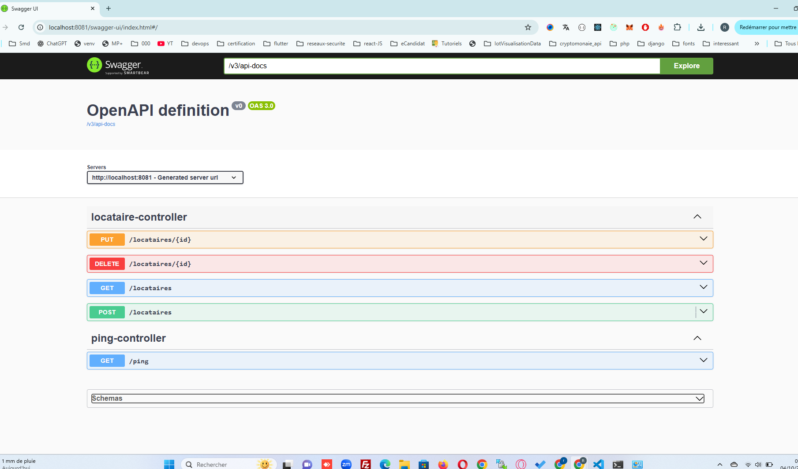

# 🏠 Locataire Service

[](https://www.oracle.com/java/)
[](https://spring.io/projects/spring-boot)
[](https://www.postgresql.org/)
[](https://www.docker.com/)
[](LICENSE)

Microservice de gestion des locataires pour l'application **GestionDeLocataire**, développé en **Java Spring Boot** avec une architecture **microservices**.

---

## 🚀 Fonctionnalités principales

- ✅ CRUD complet des locataires : ajout, modification, suppression, consultation
- 🔗 Intégration future avec les logements et les paiements
- ⚙️ Architecture extensible : RabbitMQ, sécurité, monitoring à venir
- 🧩 Développement modulaire pour faciliter la maintenance et l’évolution

---

## ⚙️ Stack technique

| Composant       | Technologie                      |
|-----------------|---------------------------------|
| Backend         | Java 17 + Spring Boot 3.5.3     |
| ORM / DB Access | Spring Data JPA                 |
| Base de données | PostgreSQL (via Docker)          |
| Config. env.    | `.env` + `application.properties` |
| Conteneurisation| Docker + Docker Compose          |
| Profil actif    | `dev` (via Spring Profiles)      |

---

## 📁 Arborescence simplifiée

```
locataire-service/
├── src/
│   └── main/
│       ├── java/
│       │   └── com/gestiondelocataire/...
│       └── resources/
│           ├── application.properties
│           ├── application-dev.properties
├── .env
├── docker-compose.yml
├── pom.xml
└── README.md
```

---

## ✅ Prérequis

- Java 17
- Maven ou wrapper (`./mvnw`)
- Docker & Docker Compose
- IDE : VS Code ou IntelliJ recommandé

---

## ▶️ Lancer le projet en local

### 1️⃣ Cloner le dépôt et se placer dans le dossier
```bash
git clone <lien_du_repo>
cd locataire-service
```

### 2️⃣ Lancer PostgreSQL avec Docker
```bash
docker-compose --env-file .env up -d
```

### 3️⃣ Démarrer l’application avec le profil `dev`
```bash
# Sous PowerShell (Windows)
$env:SPRING_PROFILES_ACTIVE="dev"; ./mvnw spring-boot:run

# OU avec variable dans .env
./mvnw spring-boot:run
```

---

## 🔐 Exemple de fichier `.env`

```env
SPRING_PROFILES_ACTIVE=dev
SPRING_PORT=8081

DB_HOST=localhost
POSTGRES_PORT=5433
POSTGRES_DB=locataires
POSTGRES_USER=loc_user
POSTGRES_PASSWORD=loc_pass
```

---

## 📌 Notes importantes

- Le service démarre sur [http://localhost:8081](http://localhost:8081)
- Aucun endpoint actif par défaut tant que les entités ne sont pas créées
- Les requêtes SQL sont visibles dans la console grâce à `show-sql=true`

---

## 🖼️ Aperçu Swagger




---

## 📚 Documentation et liens utiles

- [Spring Boot Documentation](https://spring.io/projects/spring-boot)
- [PostgreSQL Documentation](https://www.postgresql.org/docs/)
- [Docker Documentation](https://docs.docker.com/)

---

## ✍️ Auteur

**Rafik Taieb**  
Développeur Full Stack / Java / DevOps  
📧 mtaieb.rafik@gmail.com  
🌐 [LinkedIn](https://www.linkedin.com/in/rafik-taieb/)

---

## 📝 License

Ce projet est sous licence [MIT](LICENSE) 🛡️

